# Modular VPS Infrastructure via GitOps and Docker

[]()
[]()
[]()

Welcome to a uniquely structured GitOps-powered repository for managing your VPS infrastructure. Every service here lives on its own orphan Git branch, is declaratively defined, and auto-deployed to a Docker runtime on a VPS using [Komodo](https://github.com/komodorio/komodo).

This repo is more than just code – it's an **infrastructure control plane**, where Git is the source of truth and Docker is the engine of execution.

---

## 📑 Table of Contents <a id="table-of-contents"></a>

- [Purpose](#purpose)
- [How It Works](#how-it-works)
- [Requirements](#requirements)
- [Repository Structure](#repository-structure)
  - [Branching Pattern](#branching-pattern)
- [GitOps Lifecycle](#gitops-lifecycle)
  - [Sequence of Automation](#sequence-of-automation)
- [Deployment Example: Librespeed](#deployment-example-librespeed)
- [Security Overview](#security-overview)
  - [General Security Practices](#general-security-practices)
  - [Komodo Webhook Security](#komodo-webhook-security)
  - [VPS-Specific Security Considerations](#vps-specific-security-considerations)
    - [1. Restrict Open Ports](#1-restrict-open-ports)
    - [2. Enable and Configure Firewall](#2-enable-and-configure-firewall)
      - [On Ubuntu/Debian (UFW)](#on-ubuntudebian-ufw)
    - [3. Docker and UFW: Hidden Risk](#3-docker-and-ufw-hidden-risk)
      - [Mitigation: Disable Docker's iptables Manipulation](#mitigation-disable-dockers-iptables-manipulation)
      - [Optional: UFW-Docker Workaround Script](#optional-ufw-docker-workaround-script)
    - [4. Provider-Specific Port Rules](#4-provider-specific-port-rules)
      - [AWS EC2](#aws-ec2)
      - [Oracle Cloud Free Tier](#oracle-cloud-free-tier)
      - [DigitalOcean / Linode / Hetzner](#digitalocean--linode--hetzner)
    - [5. Additional Best Practices](#5-additional-best-practices)
- [Visual Architecture](#visual-architecture)
  - [High-Level Component Diagram](#high-level-component-diagram)
- [FAQ](#faq)

---

## 🎯 Purpose <a id="purpose"></a>

This repository provides a **GitOps-based deployment system** for Dockerized services running on a VPS. It organizes services as **orphan branches**, and automates deployments using Komodo whenever commits are pushed. The deployment pipeline is simple, reproducible, and secure.

Key goals:

- **Declarative** infrastructure
- **Isolated per-service** logic via orphan branches
- **Automated deployments** via Git webhooks and Komodo
- **Docker-based orchestration** on remote VPS

---

## ⚙️ How It Works <a id="how-it-works"></a>

When a commit is made to an orphan branch:

1. A Git webhook is triggered for that branch.
2. Komodo receives the webhook and pulls the latest state of the branch.
3. Komodo performs a `git diff` to determine what changed.
4. If needed, it runs `docker compose up -d` to update the live service.
5. The VPS now reflects exactly what’s in the branch.

This ensures a **declarative**, **versioned**, and **automated** deployment cycle.

---

## ✅ Requirements <a id="requirements"></a>

- A VPS with Docker and Komodo/Agent installed
- Git repository with orphan branches per service
- Git webhook setup pointing to Komodo endpoint
- Proper firewall and security settings as outlined

---

## 🗂️ Repository Structure <a id="repository-structure"></a>

This repository is **multi-branch monorepo**, and **isolated per service** using orphan branches.

### Branching Pattern <a id="branching-pattern"></a>

| Branch Name  | Service       | Contents                                |
| ------------ | ------------- | --------------------------------------- |
| `main`       | README only   | This file                               |
| `Dozzle`     | Log viewer    | `compose.yaml`, optional `env/configs/` |
| `Librespeed` | Speed test    | `compose.yaml`                          |
| `Homepage`   | Dashboard     | `compose.yaml`, `static/`, `init.sh`    |
| `...`        | More services | Follow the same pattern                 |

Each orphan branch contains:

```bash
compose.yaml
.env                    # Optional environment variables
setup.sh                 # Optional entry/setup script
configs/                # Optional configuration directory
README.md               # Optional service-specific docs
```

---

## 🔁 GitOps Lifecycle <a id="gitops-lifecycle"></a>

### Sequence of Automation <a id="sequence-of-automation"></a>


---

## 📦 Deployment Example: Librespeed <a id="deployment-example-librespeed"></a>

Branch: `Librespeed`

```yaml
services:
  librespeed:
    image: ghcr.io/librespeed/speedtest:latest
    container_name: librespeed
    restart: always
    ports:
      - "8080:80"
    volumes:
      - ./configs:/etc/librespeed
```

When you commit this `compose.yaml` to the `Librespeed` branch:

- Komodo pulls the update
- Executes `docker compose up -d`
- Exposes the speedtest server on port 8080


---

## 🔐 Security Overview <a id="security-overview"></a>

### General Security Practices <a id="general-security-practices"></a>

Running public-facing Docker services requires a secure approach. Here are best practices:

| Area             | Recommendation                                                             |
| ---------------- | -------------------------------------------------------------------------- |
| Git Webhooks     | Secure webhook with a **shared secret**                                    |
| SSH Access       | Use **SSH keys only**, disable password login                              |
| Firewall         | Use `ufw` or `iptables` to **restrict ports** by service                   |
| Reverse Proxy    | Use **Caddy/Nginx with HTTPS** in front of services                        |
| Container Images | Pin to **specific versions**, avoid `latest`                               |
| Secrets          | Store in `.env`, or use Docker secrets (don't commit to Git)               |
| Docker Isolation | Run containers with minimal privileges (`read-only`, `no-new-privs`, etc.) |
| Monitoring       | Use tools like `Dozzle` or `Prometheus` to monitor services                |


### Komodo Webhook Security <a id="komodo-webhook-security"></a>

```json
{
  "url": "https://komodo.yourdomain.com/webhook",
  "content_type": "json",
  "secret": "super-secret-token"
}
```

---

## 🛡️ VPS-Specific Security Considerations <a id="vps-specific-security-considerations"></a>

Unlike managed platforms, VPS environments often expose **all ports by default**, leaving services vulnerable if not properly secured. Always follow these practices when deploying on a VPS:

### 1. Restrict Open Ports <a id="1-restrict-open-ports"></a>

Only open ports that your services require. Common ports:


Use your firewall to restrict all others.

---

### 2. Enable and Configure Firewall <a id="2-enable-and-configure-firewall"></a>

#### On Ubuntu/Debian (UFW): <a id="on-ubuntudebian-ufw"></a>

```bash
#!/bin/sh

# Fetch Cloudflare IPs (both IPv4 and IPv6)
cf_ips=$(curl -s https://www.cloudflare.com/ips-v4) || {
    echo "Failed to fetch Cloudflare IPv4 IPs"
    exit 1
}
cf_ips="$cf_ips $(curl -s https://www.cloudflare.com/ips-v6)" || {
    echo "Failed to fetch Cloudflare IPv6 IPs"
    exit 1
}

# Allow traffic from Cloudflare IPs on ports 80 (HTTP) and 443 (HTTPS)
for cfip in $cf_ips; do
    ufw allow proto tcp from $cfip to any port 80 comment 'Cloudflare IP on port 80'
    ufw allow proto tcp from $cfip to any port 443 comment 'Cloudflare IP on port 443'
done

# Allow SSH from anywhere (port 22)
ufw allow 22 comment 'Allow SSH from anywhere'

# Reload UFW
ufw reload >/dev/null || {
    echo "Failed to reload UFW"
    exit 1
}
echo "UFW rules updated to allow Cloudflare traffic on ports 80 and 443, and SSH from anywhere"
```

---

### 3. Docker and UFW: Hidden Risk <a id="3-docker-and-ufw-hidden-risk"></a>

By default, **Docker directly modifies iptables**, which can **bypass UFW rules**, even if you've locked down ports with UFW. This means containers may be **exposed to the public internet**, despite appearing protected.

#### Mitigation: Disable Docker's iptables Manipulation <a id="mitigation-disable-dockers-iptables-manipulation"></a>

Add this to `/etc/docker/daemon.json`:

```json
{
  "iptables": false
}
```

Then restart Docker:

```bash
sudo systemctl restart docker
```

> **Warning:** You must manually manage iptables or UFW rules for container networking after disabling Docker’s iptables behavior.

#### Optional: UFW-Docker Workaround Script <a id="optional-ufw-docker-workaround-script"></a>

If you prefer to let UFW manage your Docker networking, consider using the [`ufw-docker`](https://github.com/chaifeng/ufw-docker) script:

```bash
git clone https://github.com/chaifeng/ufw-docker.git
cd ufw-docker
sudo ./install.sh
```


---

### 4. 🌐 Provider-Specific Port Rules <a id="4-provider-specific-port-rules"></a>

#### AWS EC2 <a id="aws-ec2"></a>

- Use **Security Groups**.
- Allow only required ports to `0.0.0.0/0` (or restrict to specific IP ranges).
- Example: allow ports 22, 80, 443 in the EC2 dashboard.

#### Oracle Cloud Free Tier <a id="oracle-cloud-free-tier"></a>

- Must **manually allow ingress ports** in:
  - **VNIC security list**
  - **Network Security Groups**
- Default only allows SSH (22). Add:
  - TCP 80 (HTTP)
  - TCP 443 (HTTPS)
  - TCP for your app port(s) as needed

#### DigitalOcean / Linode / Hetzner <a id="digitalocean--linode--hetzner"></a>

- Usually no firewall by default — you’re fully exposed.
- Install and configure `ufw` or `iptables` immediately after provisioning.

```mermaid
flowchart TD
  Internet["🌐 Internet"]

  %% AWS EC2
  subgraph AWS["AWS EC2"]
    SG["Security Group"]
    EC2["EC2 Instance"]
    SG --> EC2
    NoteAWS[/"Allow only 22, 80, 443 in SG Restrict IP ranges for tighter access"/]
  end
  Internet --> SG
  NoteAWS -.-> SG

  %% Oracle Cloud
  subgraph OCI["Oracle Cloud Free Tier"]
    VNIC["VNIC Security List"]
    NSG["Network Security Group"]
    InstanceOCI["Compute Instance"]
    VNIC --> InstanceOCI
    NSG --> InstanceOCI
    NoteOCI[/"Must configure both VNIC and NSG Default only allows port 22"/]
  end
  Internet --> VNIC
  Internet --> NSG
  NoteOCI -.-> VNIC

  %% DO / Linode / Hetzner
  subgraph DO["DigitalOcean/Linode/Hetzner"]
    NoFirewall["No default firewall"]
    ManualFW["Install UFW/iptables"]
    VPS["VPS Instance"]
    ManualFW --> VPS
    NoteDO[/"Fully exposed by default Set up firewall manually after provisioning"/]
  end
  Internet --> NoFirewall
  NoFirewall --> ManualFW
  NoteDO -.-> ManualFW
```



---

### 5. Additional Best Practices <a id="5-additional-best-practices"></a>

- Use **SSH keys** instead of passwords.
- Disable **root login** via SSH.
- Regularly **update and patch** (`unattended-upgrades` on Debian/Ubuntu).
- Install **Fail2Ban** to mitigate brute-force attacks:

```bash
sudo apt install fail2ban
sudo systemctl enable fail2ban
```


---

## 📊 Visual Architecture <a id="visual-architecture"></a>

### High-Level Component Diagram <a id="high-level-component-diagram"></a>


---

## ❓ FAQ <a id="faq"></a>

**Q: Why use orphan branches?**  
A: Isolates service definitions and enables independent lifecycle management and deployment.

**Q: Can I deploy multiple services on one VPS?**  
A: Yes, each orphan branch manages one service with its own docker compose.

**Q: How to handle secrets?**  
A: Use environment variables, Docker secrets, or external vaults; do not commit secrets to Git.

**Q: How to rollback?**  
A: Simply revert or checkout an older commit on the orphan branch and push; Komodo will redeploy.

---

[⬆️ Back to Top](#table-of-contents)
**THIS REPOSITORY IS ENCRYPTED. IF YOU'RE HERE, YOU'RE EITHER VERY BRAVE OR VERY LOST. EITHER WAY, GOOD LUCK!**
